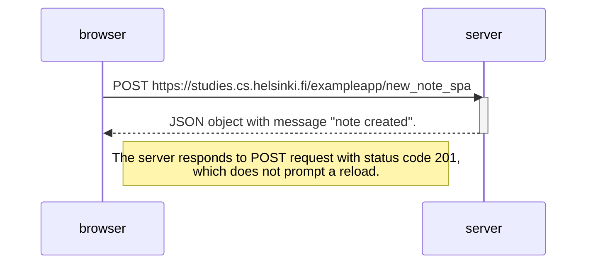

```mermaid
sequenceDiagram
    participant browser
    participant server

    browser->>server: POST https://studies.cs.helsinki.fi/exampleapp/new_note_spa
    activate server
    server-->>browser: JSON object with message "note created".
    deactivate server

    Note right of browser: The server responds to POST request with status code 201, <br> which does not prompt a reload.
```
